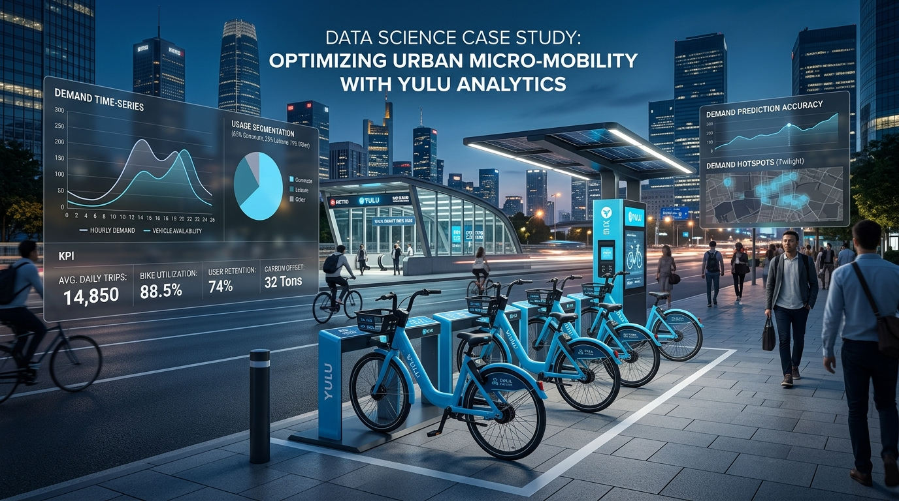
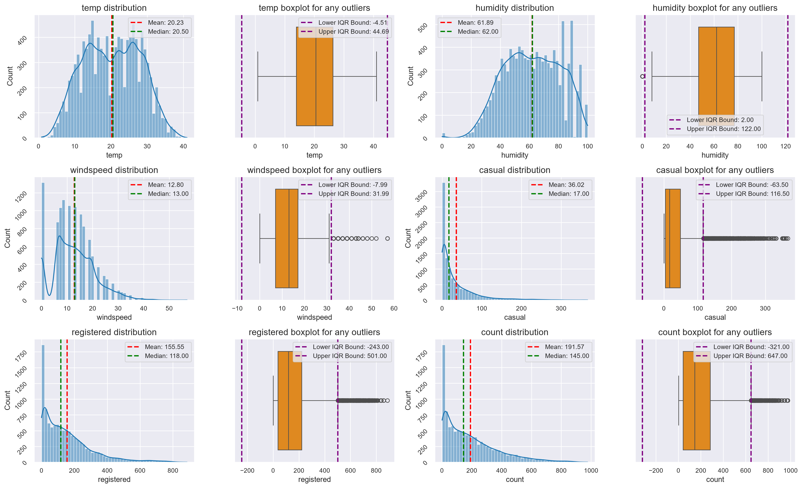
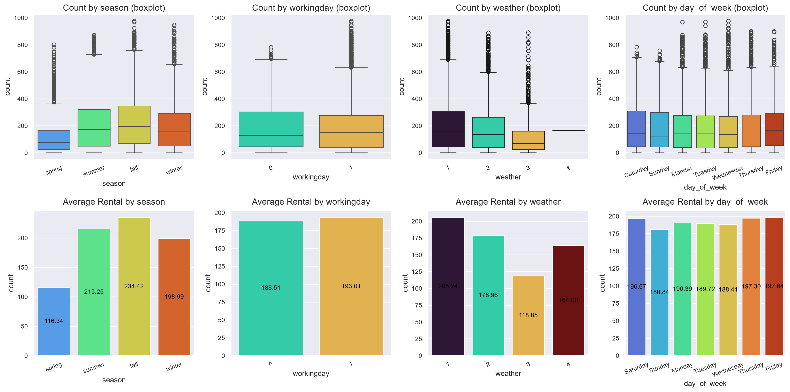
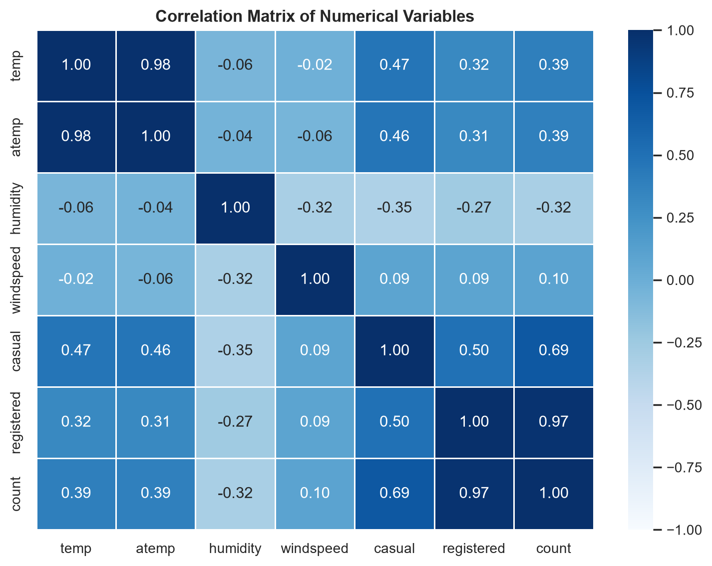

# 🚲 Yulu: Statistical Hypothesis Testing & Demand Analytics

<div align="center">


<br/>


<br/><br/>



<br/>

**Diagnosing Micro-Mobility Demand Across 10,886 Hourly Records Using Two-Sample T-Tests, Two-Way ANOVA, and Chi-Square Testing**  
*(Business Case Study completed as part of Scaler Academy's Data Science & Machine Learning Program)*

[View Case Study Report (PDF)](reports/Shivaling_Scaler_Yulu_Hypothesis_Case_Study_Report.pdf) • [View Jupyter Notebook](notebooks/Yulu_Hypothesis_Testing_Case_Study.ipynb) • [View Dataset Documentation](data/README.md) • [Live Portfolio](https://iamshivalingbattarki09.vercel.app/) • [LinkedIn Profile](https://www.linkedin.com/in/shivaling-93000/)

<br/>

<!-- Official Tech Stack Icon Ribbon -->
<table>
  <tr>
    <td align="center" width="95"><br/><sub><b>Python</b></sub></td>
    <td align="center" width="95"><br/><sub><b>Pandas</b></sub></td>
    <td align="center" width="95"><br/><sub><b>NumPy</b></sub></td>
    <td align="center" width="95"><br/><sub><b>SciPy Stats</b></sub></td>
    <td align="center" width="95"><br/><sub><b>Statsmodels</b></sub></td>
    <td align="center" width="95"><br/><sub><b>Matplotlib</b></sub></td>
    <td align="center" width="95"><br/><sub><b>Seaborn</b></sub></td>
    <td align="center" width="95"><br/><sub><b>Jupyter</b></sub></td>
    <td align="center" width="95"><br/><sub><b>GitHub</b></sub></td>
  </tr>
</table>

</div>

---

### 📌 Key Findings at a Glance

| Research Question | Statistical Test Applied | Test Metric & $p$-value | Decision ($\alpha=0.05$) | Core Business Finding |
| :--- | :--- | :--- | :--- | :--- |
| **Working Day Impact** | **2-Sample Independent T-Test** (Levene check) | $t = 1.2098$<br>$p = 0.2264$ | **Fail to Reject $H_0$** | **Total daily volume is invariant, but user composition flips.** Mean rentals are nearly identical ($193.0$ working vs $188.5$ non-working). Registered commuters drive 81% of rides peaking at 8 AM/5 PM, while casual riders jump on weekend afternoons ($59.3$/hr). |
| **Seasonal Demand** | **One-Way ANOVA** & Kruskal-Wallis | $F = 236.95$<br>$p < 10^{-100}$ | **Reject $H_0$** | **Revenue dip is a Spring collapse, not a weekday slump.** Spring demand drops by **>50%** ($116.3$ rides/hr) compared to the Fall peak ($234.4$). Summer ($215.3$) and Winter ($199.0$) sit in between. |
| **Weather Impact** | **One-Way ANOVA** & Kruskal-Wallis | $F = 65.53$<br>$p < 10^{-41}$ | **Reject $H_0$** | **Rain slashes demand by ~42%.** Clear weather averages $205.2$ rides/hr; light rain drops to $118.8$. Diagnosed single outlier record in Weather 4 ($n=1$) where sample variance cannot be estimated. |
| **Season & Weather Interaction** | **Two-Way ANOVA** (`pingouin`, SS Type-2) | Season $\eta_p^2 = 6.2\%$<br>Weather $\eta_p^2 = 1.8\%$<br>Interaction $\eta_p^2 = 0.2\%$ | **Both Significant; Negligible Interaction** | **Season sets baseline demand; weather causes daily fluctuations.** Interaction explains only $0.2\%$ of variance. Rain cuts demand by ~40% regardless of whether it occurs in Summer, Fall, or Winter. |
| **Weather vs. Season Dependency** | **Chi-Square Test ($\chi^2$)** of Independence | $\chi^2 = 283.40, df=9$<br>$p = 1.55 \times 10^{-55}$ | **Reject $H_0$** | **Weather patterns depend heavily on seasons.** Winter concentrates misty/cloudy days (29.5%), while Summer and Fall provide maximum clear riding hours. |

---

## 🎯 Business Problem & Context

Yulu is India’s leading micro-mobility provider, offering shared solo electric cycle rentals across metro stations, transit hubs, and tech corridors.

Following a **conspicuous revenue and fleet utilization slump**, leadership requested an analytical diagnostic across 10,886 hourly records:
1. **Identify Primary Drivers:** Which environmental and calendar variables govern hourly rental volume?
2. **Decompose Rider Dynamics:** Do registered commuters and casual riders respond differently to working days?
3. **Actionable Operations:** How can Yulu optimize daily fleet rebalancing and mitigate seasonal slumps?

---

## 📊 Exploratory Data Analysis: Visual Highlights

### 1. Univariate Distributions & Outliers (Continuous Variables)
*(Generated directly from Cell 18 of the analysis notebook)*

<div align="center">
  
</div>

- **Skewness:** Hourly rental count is right-skewed (mean **191.6** vs median **145.0**) with peak volumes reaching **977 bikes/hour**.
- **Sensor Zeros:** `windspeed` contains 1,313 zero readings, reflecting anemometer cut-in measurement thresholds rather than still air.
- **Outliers:** Boxplots isolate transit rush hour surges as legitimate peak demand rather than corrupted data.

---

### 2. Bivariate Analysis: Categorical Features vs. Demand
*(Generated directly from Cell 22 of the analysis notebook using `palette = 'turbo'`)*

<div align="center">
  
</div>

- **Season Effect:** Fall leads at **234.4 rides/hr**, followed by Summer (**215.3**), Winter (**199.0**), and Spring (**116.3**).
- **Working Day Parity:** Mean demand is identical (**193.0** working days vs **188.5** non-working days).
- **Weather Drop:** Clear conditions average **205.2 rides/hr**, dropping to **118.8 rides/hr** in rain/snow.

---

### 3. Correlation Matrix & Multicollinearity
*(Generated directly from Cell 23 of the analysis notebook)*

<div align="center">
  
</div>

- **Multicollinearity:** `temp` and `atemp` exhibit $r = 0.98$, confirming redundant temperature tracking.
- **Thermal Drivers:** Temperature positively correlates with demand ($r = +0.39$), while humidity dampens usage ($r = -0.32$).

---

## 🔬 Statistical Hypothesis Testing & Diagnostics

### 1. Working Day vs. Count (2-Sample T-Test)
- **Null Hypothesis ($H_0$):** $\mu_{\text{working}} = \mu_{\text{non-working}}$ | **Alternative ($H_a$):** $\mu_{\text{working}} \neq \mu_{\text{non-working}}$
- **Test Metric:** $t = 1.2098, p = 0.2264$ | **Decision:** Fail to Reject $H_0$ ($\alpha = 0.05$).
- **Takeaway:** Total daily volume is invariant. However, registered commuters drive 81.2% of weekday volume (peaking at 8 AM and 5 PM), whereas casual users more than double on weekend afternoons ($59.3$/hr vs $25.1$/hr).

<details>
<summary><b>🔍 View Code, Assumptions & Diagnostics (Click to expand)</b></summary>
<br>

```python
# 1. Normality & CLT Check
# Shapiro-Wilk p < 0.05 on raw sample; Central Limit Theorem ensures sampling mean normality (N > 3,000 per group).

# 2. Levene's Test for Homogeneity of Variance
levene_stat, levene_p = stats.levene(working_days, non_working_days)
# Statistic = 0.0049, p-value = 0.9438 -> Equal variance assumption holds.

# 3. Two-Sample Independent T-Test
t_stat, t_p = stats.ttest_ind(working_days, non_working_days, equal_var=True)
# t-statistic = 1.2098, p-value = 0.2264 -> Fail to Reject H0.
```
</details>

---

### 2. Season & Weather vs. Count (One-Way & Two-Way ANOVA)
- **One-Way ANOVA (Season):** $F = 236.95, p < 10^{-100}$ (Kruskal-Wallis $H = 699.66, p < 10^{-100}$) $\rightarrow$ **Reject $H_0$**.
- **One-Way ANOVA (Weather):** $F = 65.53, p < 10^{-41}$ (Kruskal-Wallis $p < 10^{-43}$) $\rightarrow$ **Reject $H_0$**.
- **Two-Way ANOVA (`pingouin.anova`):** Evaluated main effects and interaction after isolating the single $n=1$ record in Weather 4.

| Factor | Sum of Squares | $DF$ | $F$-Statistic | $p$-value | Partial Eta-Squared ($\eta_p^2$) |
| :--- | :---: | :---: | :---: | :---: | :---: |
| **Season** | $2.22 \times 10^7$ | 3 | $239.52$ | **$< 10^{-100}$** | **$6.2\%$ (Primary Driver)** |
| **Weather** | $6.27 \times 10^6$ | 2 | $101.27$ | **$< 10^{-35}$** | **$1.8\%$ (Secondary Driver)** |
| **Weather $\times$ Season** | $7.76 \times 10^5$ | 6 | $4.18$ | **$4.14 \times 10^{-8}$** | **$0.2\%$ (Negligible Interaction)** |

> **Key Finding:** Season governs macro quarterly volume (Spring slump of ~116 rides/hr). Weather causes daily fluctuations (~40% rain drop). Because the interaction explains only $0.2\%$ of variance, bad weather reduces demand by roughly the same margin across all seasons.

<details>
<summary><b>🔍 View Two-Way ANOVA Implementation Code (Click to expand)</b></summary>
<br>

```python
# Drop single outlier row (weather=4, n=1) to allow valid variance estimation
yulu_anova = yulu[yulu['weather'] != 4]

# Run Two-Way ANOVA with Type-2 Sum of Squares
model = pg.anova(dv='count', between=['weather', 'season'], data=yulu_anova, ss_type=2, detailed=True)
print(round(model, 6))
```
</details>

---

### 3. Weather vs. Season (Chi-Square Test of Independence)
- **Null Hypothesis ($H_0$):** Weather condition is independent of season.
- **Test Metric:** $\chi^2 = 283.40, df = 9, p = 1.55 \times 10^{-55}$ | **Decision:** Reject $H_0$ ($\alpha = 0.05$).
- **Takeaway:** Weather conditions depend significantly on season. Winter has the highest misty/cloudy frequency (29.5%), while Summer and Fall have the highest clear-riding hours.

<details>
<summary><b>🔍 View Contingency Table & Chi-Square Code (Click to expand)</b></summary>
<br>

```python
# Observed Frequency Matrix
crosstab_all = pd.crosstab(yulu['season'], yulu['weather'])

# Chi-Square Test
chi2_stat, p_val, dof, expected = stats.chi2_contingency(crosstab_all)
# chi2 = 283.40, p = 1.55e-55, df = 9 -> Reject H0.
```
</details>

---

## 🎯 Actionable Strategic Recommendations

1. **Dynamic Fleet Rebalancing:**
   - **Weekdays (07:30–10:00 & 16:30–19:00):** Stage 70–80% of cycles at metro stations and corporate parks for commuters. Deploy retrieval vans mid-day (10:00–15:00) to reset stations.
   - **Weekends (11:00–17:00):** Reposition cycles toward city parks, lakefronts, and university campuses to capture casual riders.

2. **Commuter Subscription Passes (Lock in 81% Volume):**
   - Introduce monthly and quarterly commuter passes for registered riders. Commuters generate 81.2% of rides; recurring subscriptions stabilize cash flow against seasonal dips.

3. **Spring Slump Utilization Plan:**
   - With Spring demand at ~116 rides/hr (vs 234 in Fall), pull 25–30% of the active fleet into depots for deep battery maintenance, motor overhaul, and firmware upgrades. Run student discount passes to lift baseline usage.

4. **Rainy Day Protocol:**
   - When rain is forecast, shelter outdoor battery swapping stations and halt over-dispatching rebalancing teams during active downpours.

---

## 📁 Repository Structure

```
Yulu_Hypothesis-Business-Case-Study-Github/
├── .gitignore                                              # Git exclusion rules
├── README.md                                               # Master case study documentation
├── assets/                                                 # Authentic charts & official SVG icons
│   ├── yulu_logo.png                                       # Brand logo
│   ├── 01_univariate_continuous_distributions.png          # Exact Cell 18: Continuous distributions
│   ├── 02_bivariate_categorical_vs_count.png               # Exact Cell 22: Bivariate box & bar plots
│   ├── 03_correlation_matrix.png                           # Exact Cell 23: Numerical correlation heatmap
│   └── icons/                                              # Official tech stack SVG icon library
├── data/
│   ├── bike_sharing.csv                                    # 10,886 hourly rows
│   └── README.md                                           # Data dictionary & profiling
├── docs/
│   └── Problem_Statement.md                                # Official business case brief
├── notebooks/
│   └── Yulu_Hypothesis_Testing_Case_Study.ipynb            # Jupyter notebook
└── reports/
    └── Shivaling_Scaler_Yulu_Hypothesis_Case_Study_Report.pdf  # Submitted PDF report
```

---

## 🚀 How to Run & Reproduce

```bash
# 1. Clone repo
git clone https://github.com/Hazardous9hub/Yulu-Hypothesis-Testing-Business-Case-Study.git
cd Yulu-Hypothesis-Testing-Business-Case-Study

# 2. Install dependencies
pip install pandas numpy scipy statsmodels pingouin matplotlib seaborn jupyter

# 3. Launch notebook
jupyter notebook notebooks/Yulu_Hypothesis_Testing_Case_Study.ipynb
```

---

## 👨‍💻 Author & Connect

**Shivaling Battarki**  
*Data Analyst | Ex-BPCL | Mechanical Engineer (8.67 CGPA) | Scaler DSML Fellow*

- 🌐 **Live Portfolio:** [iamshivalingbattarki09.vercel.app](https://iamshivalingbattarki09.vercel.app/)
- 💼 **LinkedIn Profile:** [linkedin.com/in/shivaling-93000](https://www.linkedin.com/in/shivaling-93000/)
- 🐙 **GitHub Profile:** [github.com/Hazardous9hub](https://github.com/Hazardous9hub)
- 📊 **Tableau Public:** [public.tableau.com/app/profile/shivaling.battarki](https://public.tableau.com/app/profile/shivaling.battarki/vizzes)
- ✉️ **Email:** [shivalingb09@gmail.com](mailto:shivalingb09@gmail.com)
