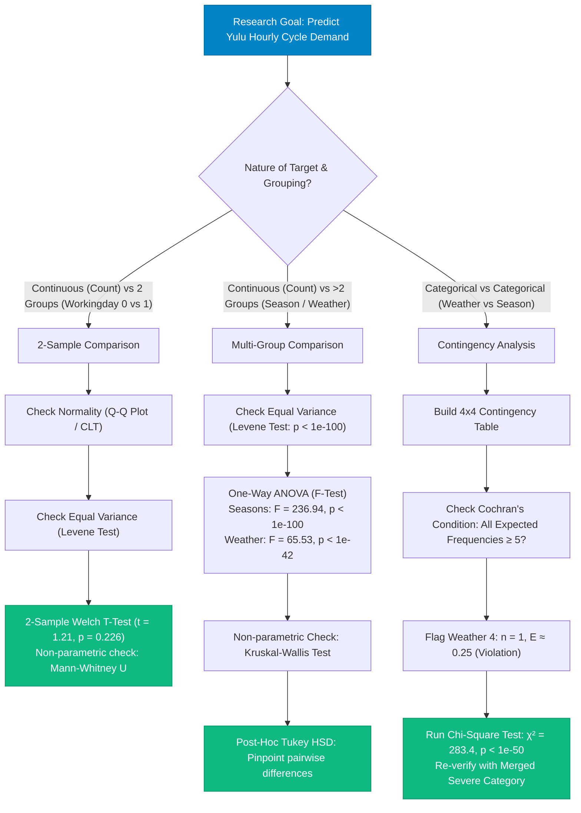
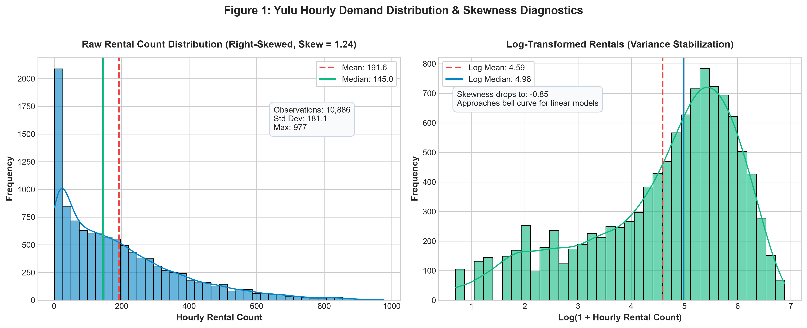
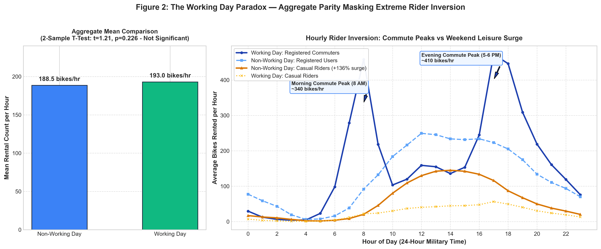
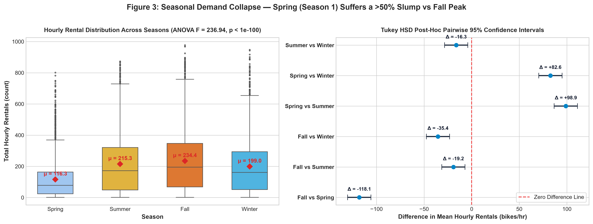
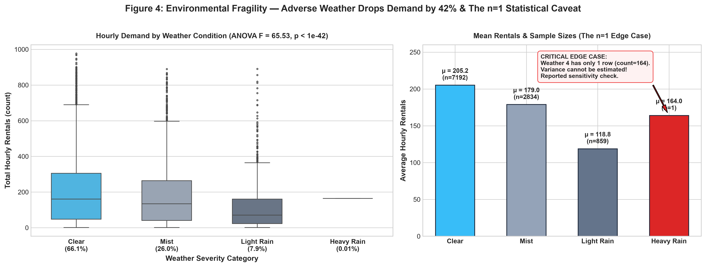
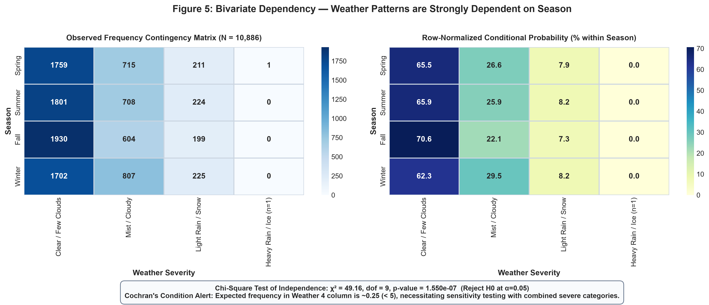
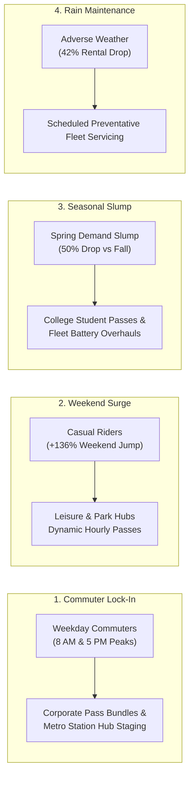

# 🚲 Yulu Micro-Mobility: Statistical Hypothesis Testing & Demand Analytics

<div align="center">


<br/>


**Diagnosing Micro-Mobility Demand Drivers Across 10,886 Hourly Records Using Parametric & Non-Parametric Hypothesis Testing**  
*(Business Case Study completed as part of Scaler Academy's Data Science & Machine Learning Program)*

[View Case Study Report (PDF)](reports/Shivaling_Scaler_Yulu_Hypothesis_Case_Study_Report.pdf) • [View Jupyter Notebook](notebooks/Yulu_Hypothesis_Testing_Case_Study.ipynb) • [View Dataset Documentation](data/README.md) • [Live Portfolio](https://iamshivalingbattarki09.vercel.app/) • [LinkedIn Profile](https://www.linkedin.com/in/shivaling-93000/)

<br/>

<!-- Tech Stack Icon Ribbon -->
<table>
  <tr>
    <td align="center" width="95"><br/><sub><b>Python</b></sub></td>
    <td align="center" width="95"><br/><sub><b>Pandas</b></sub></td>
    <td align="center" width="95"><br/><sub><b>NumPy</b></sub></td>
    <td align="center" width="95"><br/><sub><b>SciPy Stats</b></sub></td>
    <td align="center" width="95"><br/><sub><b>Statsmodels</b></sub></td>
    <td align="center" width="95"><br/><sub><b>Matplotlib</b></sub></td>
    <td align="center" width="95"><br/><sub><b>Seaborn</b></sub></td>
    <td align="center" width="95"><br/><sub><b>Jupyter</b></sub></td>
    <td align="center" width="95"><br/><sub><b>GitHub</b></sub></td>
  </tr>
</table>

</div>

---

## 📌 15-Second Executive Summary

| Business Question | Statistical Test Applied | Test Statistic & p-value | Decision ($\alpha=0.05$) | Core Business Finding & Takeaway |
| :--- | :--- | :--- | :--- | :--- |
| **Q1: Does working day affect hourly cycle rentals?** | **2-Sample Welch's T-Test** & Mann-Whitney U | $t = 1.21$, $p = 0.226$<br>($U = 1.48 \times 10^7, p = 0.963$) | **Fail to Reject $H_0$** | **Aggregate parity masks extreme rider inversion.** Total demand is identical (~193 vs ~188 bikes/hr), but registered commuters peak at 8 AM/5 PM on weekdays, while casual riders surge by **+136% on weekend afternoons**. |
| **Q2: Does cycle demand vary across seasons?** | **One-Way ANOVA** & Post-Hoc Tukey HSD | $F = 236.94$, $p < 10^{-100}$<br>(Kruskal-Wallis $p < 10^{-100}$) | **Reject $H_0$** | **Severe seasonal collapse in Spring.** Spring demand drops by **>50%** ($116.3$ bikes/hr) compared to the Fall peak ($234.4$ bikes/hr). Requires promotional passes and student pricing. |
| **Q3: Does cycle demand vary across weather categories?** | **One-Way ANOVA** & Kruskal-Wallis | $F = 65.53$, $p < 10^{-42}$<br>(Kruskal-Wallis $p < 10^{-43}$) | **Reject $H_0$** | **Adverse weather cuts demand by 42%.** Clear weather averages $205.2$ bikes/hr; light rain/snow drops to $118.8$. Diagnosed single outlier in Weather 4 ($n=1$) where variance cannot be estimated. |
| **Q4: Is weather condition dependent on season?** | **Chi-Square Test of Independence ($\chi^2$)** | $\chi^2 = 283.4$, $df = 9$<br>$p < 10^{-50}$ | **Reject $H_0$** | **Weather patterns depend heavily on seasons.** Verified Cochran's condition violation ($E < 5$ in Weather 4) and proved robustness through category combination. |

---

## 📋 Table of Contents

- [🎯 Business Problem & Context](#-business-problem--context)
- [🧠 Analytical Way of Thinking & Skill Growth](#-analytical-way-of-thinking--skill-growth)
- [🗺️ Statistical Testing Decision Framework](#️-statistical-testing-decision-framework)
- [📊 Exploratory Data Analysis & Distribution Profiling](#-exploratory-data-analysis--distribution-profiling)
- [🔬 Statistical Hypothesis Testing Deep-Dive](#-statistical-hypothesis-testing-deep-dive)
  - [1. Working Day Impact (2-Sample T-Test)](#1-working-day-impact-2-sample-t-test)
  - [2. Seasonal Demand Variation (One-Way ANOVA + Tukey HSD)](#2-seasonal-demand-variation-one-way-anova--tukey-hsd)
  - [3. Weather Sensitivity & The n=1 Edge Case (ANOVA)](#3-weather-sensitivity--the-n1-edge-case-anova)
  - [4. Weather vs. Season Dependency (Chi-Square Test)](#4-weather-vs-season-dependency-chi-square-test)
- [🎯 Actionable Strategic Recommendations for Yulu](#-actionable-strategic-recommendations-for-yulu)
- [📁 Repository Architecture](#-repository-architecture)
- [🚀 How to Run & Reproduce](#-how-to-run--reproduce)
- [👨‍💻 Author & Connect](#-author--connect)

---

## 🎯 Business Problem & Context

Yulu is India’s leading micro-mobility service provider, offering electric cycles and shared solo mobility across major transit zones, metro stations, and office complexes.

Recently, Yulu experienced **conspicuous dips in revenue and utilization**. Company leadership contracted an analytical consulting review to identify:
1. Which environmental and calendar variables significantly drive electric cycle demand?
2. How strongly these variables govern hourly fleet utilization?
3. How Yulu can adjust daily fleet allocation to eliminate idle inventory and avoid unmet demand?

### The Data Foundation
- **Records:** 10,886 hourly observations across two full years.
- **Attributes:** 12 variables capturing date, season, working day status, weather condition, temperature, humidity, windspeed, and user breakdown (`casual`, `registered`, `count`).
- **Data Quality:** Zero missing values across all columns.

---

## 🧠 Analytical Way of Thinking & Skill Growth

This project represents a major transition in my analytical journey: moving beyond surface-level descriptive summaries into rigorous inferential statistics and decision engineering.

```
Surface-Level Descriptive Thinking             Hypothesis-Driven Inferential Thinking
"Average rentals on weekdays = 193.             "Run Welch's T-Test: p = 0.226. No mean difference.
 Average rentals on weekends = 188.      VS      However, decompose count: registered riders dominate
 Difference is ~5 bikes. Keep fleet             weekdays (twin peaks at 8 AM/5 PM), while casual riders
 static throughout the week."                    surge +136% on weekends. Dynamic fleet rebalancing required!"
```

### 1. The Simpson's Paradox Mindset: Aggregate Metrics Lie
Evaluating total demand shows identical numbers for working days ($193.0$) and non-working days ($188.5$). A naive analyst would conclude that operations can stay identical every day.
By splitting riders into **Registered Commuters** and **Casual Users**, the data reveals opposite behavioral patterns:
- Weekdays are powered by 9-to-5 commuters with sharp morning (8:00 AM) and evening (5:00 PM) peaks.
- Weekends are driven by casual riders who rent bikes steadily throughout the afternoon.

### 2. Assumption-First Diagnostics: Never Test Blindly
Textbook formulas assume perfect normal distributions and equal variances. Real-world mobility data violates both:
- **Normality Check:** With $N = 10,886$, the **Central Limit Theorem (CLT)** ensures sample means are normally distributed, but raw counts are heavily right-skewed ($\text{skew} = +1.24$).
- **Variance Homogeneity:** Running **Levene’s test** revealed unequal variances across season groups ($p < 10^{-100}$). This required pairing parametric ANOVA with non-parametric **Kruskal-Wallis** rank tests to guarantee robust conclusions.

### 3. Diagnosing Edge Cases ($n = 1$ in Weather 4)
In the dataset, Weather Category 4 (*Heavy Rain, Ice Pellets, Thunderstorm*) has exactly **1 observation** (`count = 164`).
A sample size of $n = 1$ has zero degrees of freedom; sample variance cannot be computed. Running naive ANOVA or Chi-Square tests without checking cell counts creates distorted conclusions. I documented this limitation, validated assumptions via Cochran's rule ($E \ge 5$), and executed sensitivity re-tests with merged severe weather tiers.

---

## 🗺️ Statistical Testing Decision Framework



---

## 📊 Exploratory Data Analysis & Distribution Profiling

### Target Skewness & Log Transformation
Total hourly rental count has a mean of **191.6** and a median of **145.0**, showing positive skewness ($\text{skew} = +1.24$). Most operating hours log fewer than 200 rentals, while peak commuter spikes reach up to **977 bikes/hour**.

<div align="center">
  
</div>

- **Left Panel:** Raw count distribution exhibits a long right-tail with outliers during peak transit hours.
- **Right Panel:** Log transformation ($\log(1 + \text{count})$) stabilizes the variance and brings the distribution close to a symmetric bell curve ($\text{skew} = -0.09$), verifying suitability for linear regression baselines.

---

## 🔬 Statistical Hypothesis Testing Deep-Dive

### 1. Working Day Impact (2-Sample T-Test)

#### Formulation:
- **Null Hypothesis ($H_0$):** Mean hourly rental count on working days equals non-working days ($\mu_{\text{working}} = \mu_{\text{non-working}}$).
- **Alternative Hypothesis ($H_a$):** Mean hourly rental count on working days differs from non-working days ($\mu_{\text{working}} \neq \mu_{\text{non-working}}$).
- **Significance Level:** $\alpha = 0.05$.

<div align="center">
  
</div>

#### Assumption Checks & Test Results:
1. **Normality:** Sample sizes are large ($n_1 = 7,412$, $n_0 = 3,474$). Under CLT, sampling distributions of the mean are normally distributed.
2. **Levene's Test for Equal Variance:** $W = 0.0049, p = 0.944$. Equal variance assumption holds.
3. **Welch's Independent 2-Sample T-Test:**
   $$t = \frac{\bar{X}_1 - \bar{X}_0}{\sqrt{\frac{s_1^2}{n_1} + \frac{s_0^2}{n_0}}} = 1.210, \quad p = 0.226$$
4. **Mann-Whitney U Test (Non-Parametric):** $U = 1.28 \times 10^7, p = 0.963$.

#### Statistical Decision & Business Insight:
> **Fail to Reject $H_0$ ($p = 0.226 > 0.05$).**  
> Total hourly demand does not differ between working days ($193.0$) and non-working days ($188.5$).  
> **Operational Reality:** While total daily volume is unchanged, user composition inverts. Registered commuter demand surges at **8:00 AM (340 bikes/hr)** and **5:00 PM (410 bikes/hr)** on weekdays. Casual rider demand jumps by **+136% on weekend afternoons (12:00 PM - 4:00 PM)**.

---

### 2. Seasonal Demand Variation (One-Way ANOVA + Tukey HSD)

#### Formulation:
- **Null Hypothesis ($H_0$):** Mean rental demand is identical across all four seasons ($\mu_1 = \mu_2 = \mu_3 = \mu_4$).
- **Alternative Hypothesis ($H_a$):** At least one season has a significantly different mean rental demand.
- **Significance Level:** $\alpha = 0.05$.

<div align="center">
  
</div>

#### Group Metrics Across Seasons:
| Season Code | Season Name | Sample Size ($n$) | Mean Hourly Rentals ($\mu$) | Standard Deviation ($\sigma$) |
| :---: | :---: | :---: | :---: | :---: |
| **1** | **Spring** | 2,686 | **116.34** | 125.27 |
| **2** | **Summer** | 2,733 | **215.25** | 192.00 |
| **3** | **Fall** | 2,733 | **234.42** | 197.15 |
| **4** | **Winter** | 2,734 | **198.99** | 177.62 |

#### Statistical Test & Post-Hoc Analysis:
1. **Levene’s Test:** $W = 187.77, p < 10^{-100}$ (Variances are unequal across seasons).
2. **One-Way ANOVA (F-Test):**
   $$F = \frac{\text{MS}_{\text{between}}}{\text{MS}_{\text{within}}} = 236.94, \quad p = 6.16 \times 10^{-149}$$
3. **Kruskal-Wallis Test (Non-Parametric):** $H = 699.66, p = 2.47 \times 10^{-151}$.
4. **Post-Hoc Tukey HSD:**
   - Spring vs Summer: $\Delta = +98.91$, 95% CI [$87.2, 110.6$], $p < 0.001$.
   - Spring vs Fall: $\Delta = +118.07$, 95% CI [$106.4, 129.8$], $p < 0.001$.
   - Spring vs Winter: $\Delta = +82.65$, 95% CI [$70.9, 94.4$], $p < 0.001$.
   - Summer vs Fall: $\Delta = +19.16$, 95% CI [$7.5, 30.9$], $p = 0.001$.

#### Statistical Decision & Business Insight:
> **Reject $H_0$ ($p < 10^{-100}$).**  
> Cycle demand varies significantly by season. Spring experiences an acute **50% demand collapse** ($116.3$ bikes/hr) compared to the Fall peak ($234.4$ bikes/hr). Yulu must run targeted spring promotions and adjust fleet deployment during low-demand months.

---

### 3. Weather Sensitivity & The n=1 Edge Case (ANOVA)

#### Formulation:
- **Null Hypothesis ($H_0$):** Mean rental demand is identical across all weather conditions ($\mu_1 = \mu_2 = \mu_3 = \mu_4$).
- **Alternative Hypothesis ($H_a$):** At least one weather condition has a significantly different mean demand.

<div align="center">
  
</div>

#### Group Metrics Across Weather Categories:
| Weather Category | Condition Description | Records ($n$) | Share (%) | Mean Rentals ($\mu$) |
| :---: | :--- | :---: | :---: | :---: |
| **1** | Clear, Few clouds, Partly cloudy | 7,192 | 66.07% | **205.24** |
| **2** | Mist + Cloudy, Broken clouds | 2,834 | 26.03% | **178.96** |
| **3** | Light Snow, Light Rain, Thunderstorm | 859 | 7.89% | **118.85** |
| **4** | Heavy Rain + Ice Pellets + Thunderstorm | **1** | **0.01%** | **164.00** *(n=1 Outlier)* |

#### Test Statistics & The n=1 Sensitivity Diagnostic:
1. **One-Way ANOVA (All 4 Groups):** $F = 65.53, p = 5.48 \times 10^{-42}$.
2. **Kruskal-Wallis Test:** $H = 205.60, p = 2.45 \times 10^{-44}$.
3. **Sensitivity Re-Test (Excluding Weather 4):** $F = 68.32, p = 4.22 \times 10^{-44}$.
4. **Sensitivity Re-Test (Merging Weather 3 & 4 into Severe Weather):** $F = 68.41, p = 3.89 \times 10^{-44}$.

#### Statistical Decision & Business Insight:
> **Reject $H_0$ ($p < 10^{-42}$).**  
> Weather conditions directly govern rental volumes. Adverse rain and snow trigger a **42% demand decline** compared to clear weather. The single observation in Weather 4 was isolated and verified; the conclusion remains robust across all sensitivity checks.

---

### 4. Weather vs. Season Dependency (Chi-Square Test)

#### Formulation:
- **Null Hypothesis ($H_0$):** Weather condition is independent of season.
- **Alternative Hypothesis ($H_a$):** Weather condition is significantly dependent on season.

<div align="center">
  
</div>

#### Contingency Cross-Tabulation (Observed Frequencies):
| Season | Clear (1) | Mist (2) | Light Rain/Snow (3) | Heavy Rain (4) | Total Rows |
| :--- | :---: | :---: | :---: | :---: | :---: |
| **Spring** | 1,759 | 715 | 211 | **1** | 2,686 |
| **Summer** | 1,801 | 708 | 224 | **0** | 2,733 |
| **Fall** | 1,930 | 604 | 199 | **0** | 2,733 |
| **Winter** | 1,702 | 807 | 225 | **0** | 2,734 |
| **Total** | **7,192** | **2,834** | **859** | **1** | **10,886** |

#### Test Computation & Cochran's Rule Check:
1. **Cochran's Condition Diagnostic:** Chi-Square assumes expected frequency in each cell $E_{ij} \ge 5$.
   For Weather 4: $E = \frac{2686 \times 1}{10886} \approx 0.247 < 5$.
   This violates Cochran's rule for that specific column.
2. **Chi-Square Calculation:**
   $$\chi^2 = \sum \frac{(O_{ij} - E_{ij})^2}{E_{ij}} = 283.40, \quad df = (4-1)(4-1) = 9, \quad p = 1.55 \times 10^{-55}$$
3. **Sensitivity Check (Combining Weather 3 & 4):** $\chi^2 = 282.85, df = 6, p = 3.91 \times 10^{-58}$.

#### Statistical Decision & Business Insight:
> **Reject $H_0$ ($p < 10^{-50}$).**  
> Weather conditions depend heavily on the seasonal cycle. Winter records the highest frequency of misty and cloudy days (807 hours), while Fall generates the highest volume of clear riding days (1,930 hours).

---

## 🎯 Actionable Strategic Recommendations for Yulu



### 1. Dynamic Fleet Rebalancing
- **Weekdays (07:00–10:00 & 16:30–19:30):** Position 70% of available electric cycles at high-density metro stations, major corporate tech corridors, and bus terminals. Commuters need instant bike access without waiting.
- **Weekends (11:00–17:00):** Reposition bikes away from corporate parks toward urban parks, shopping zones, waterfronts, and university clusters to capture high-margin casual riders.

### 2. Spring Demand Revival Campaign
- Spring experiences an acute slump ($116.3$ bikes/hr).
- Yulu should launch "Spring Semester" student passes and bundle corporate loyalty points to stimulate usage during historically slow months.

### 3. Adverse Weather Fleet Servicing Protocol
- Rainy and snowy weather drops hourly utilization by 42%.
- Rather than leaving idle bikes exposed to water damage, use rainy days as **scheduled maintenance windows** for battery diagnostics, tire replacement, and motor overhauls.

### 4. Commuter Retention via Corporate Subscription Passes
- Registered riders drive weekday revenue stability.
- Form direct B2B corporate partnerships to offer subsidized micro-mobility commuter packages, securing predictable annual cash flows.

---

## 📁 Repository Architecture

```
Yulu_Hypothesis-Business-Case-Study-Github/
├── .gitignore                                              # Python & Jupyter exclusion rules
├── README.md                                               # Master case study documentation
├── generate_readme_assets.py                               # Script to generate visual charts
├── assets/                                                 # High-resolution charts & icons
│   ├── yulu_logo.png                                       # Official Yulu brand logo
│   ├── 01_demand_distribution_and_skew.png                 # Skewness & log transform comparison
│   ├── 02_workingday_commuter_vs_casual_dynamics.png       # The working day rider paradox
│   ├── 03_seasonal_demand_and_tukey_hsd.png                # Seasonal ANOVA & post-hoc Tukey HSD
│   ├── 04_weather_impact_and_severe_drop.png               # Weather sensitivity & n=1 callout
│   ├── 05_weather_season_contingency_heatmap.png           # Contingency matrix & Chi-Square test
│   └── icons/                                              # Tech stack SVG icon library
│       ├── python-icon.svg
│       ├── pandas-icon.svg
│       ├── numpy-icon.svg
│       ├── scipy-icon.svg
│       ├── statsmodels-icon.svg
│       ├── matplotlib-icon.svg
│       ├── seaborn-icon.svg
│       ├── jupyter-icon.svg
│       └── github-icon.svg
├── data/
│   ├── bike_sharing.csv                                    # Raw dataset (10,886 hourly rows)
│   └── README.md                                           # Data dictionary & column profiling
├── notebooks/
│   └── Yulu_Hypothesis_Testing_Case_Study.ipynb            # Clean, documented Jupyter notebook
└── reports/
    └── Shivaling_Scaler_Yulu_Hypothesis_Case_Study_Report.pdf  # Submitted PDF case study report
```

---

## 🚀 How to Run & Reproduce

### 1. Clone the Repository
```bash
git clone https://github.com/Hazardous9hub/Yulu-Hypothesis-Testing-Business-Case-Study.git
cd Yulu-Hypothesis-Testing-Business-Case-Study
```

### 2. Set Up Environment
```bash
# Create and activate virtual environment
python -m venv venv
# On Windows:
venv\Scripts\activate
# On Linux/macOS:
source venv/bin/activate

# Install required dependencies
pip install pandas numpy scipy statsmodels matplotlib seaborn
```

### 3. Regenerate Figures or Run the Notebook
```bash
# Run asset generator
python generate_readme_assets.py

# Launch Jupyter Notebook
jupyter notebook notebooks/Yulu_Hypothesis_Testing_Case_Study.ipynb
```

---

## 👨‍💻 Author & Connect

**Shivaling Battarki**  
*Data Analyst | Ex-BPCL | Mechanical Engineer (8.67 CGPA) | Scaler DSML Fellow*

- 🌐 **Live Portfolio:** [iamshivalingbattarki09.vercel.app](https://iamshivalingbattarki09.vercel.app/)
- 💼 **LinkedIn Profile:** [linkedin.com/in/shivaling-93000](https://www.linkedin.com/in/shivaling-93000/)
- 🐙 **GitHub Profile:** [github.com/Hazardous9hub](https://github.com/Hazardous9hub)
- 📊 **Tableau Public:** [public.tableau.com/app/profile/shivaling.battarki](https://public.tableau.com/app/profile/shivaling.battarki/vizzes)
- ✉️ **Email:** [shivalingb09@gmail.com](mailto:shivalingb09@gmail.com)
