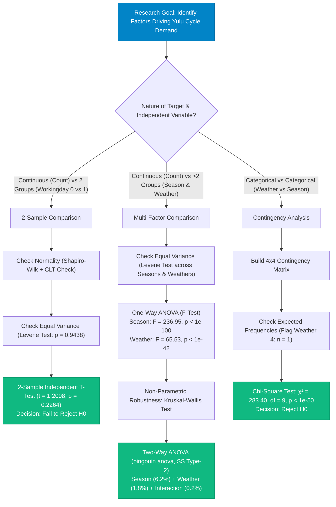
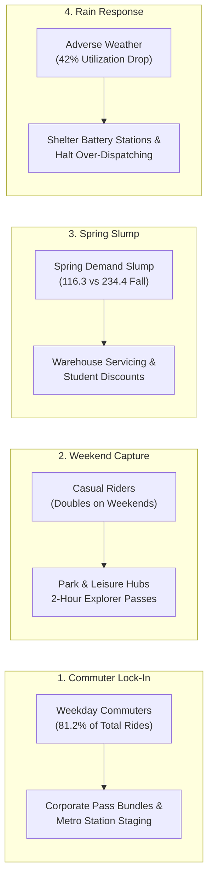

# 🚲 Yulu: Statistical Hypothesis Testing & Demand Analytics

<div align="center">


<br/>


**Diagnosing Electric Cycle Demand Across 10,886 Hourly Records Using Two-Sample T-Tests, One-Way & Two-Way ANOVA, and Chi-Square Testing**  
*(Business Case Study completed as part of Scaler Academy's Data Science & Machine Learning Program)*

[View Case Study Report (PDF)](reports/Shivaling_Scaler_Yulu_Hypothesis_Case_Study_Report.pdf) • [View Jupyter Notebook](notebooks/Yulu_Hypothesis_Testing_Case_Study.ipynb) • [View Dataset Documentation](data/README.md) • [Live Portfolio](https://iamshivalingbattarki09.vercel.app/) • [LinkedIn Profile](https://www.linkedin.com/in/shivaling-93000/)

<br/>

<!-- Tech Stack Icon Ribbon with Official Logos -->
<table>
  <tr>
    <td align="center" width="95"><br/><sub><b>Python</b></sub></td>
    <td align="center" width="95"><br/><sub><b>Pandas</b></sub></td>
    <td align="center" width="95"><br/><sub><b>NumPy</b></sub></td>
    <td align="center" width="95"><br/><sub><b>SciPy Stats</b></sub></td>
    <td align="center" width="95"><br/><sub><b>Statsmodels</b></sub></td>
    <td align="center" width="95"><br/><sub><b>Matplotlib</b></sub></td>
    <td align="center" width="95"><br/><sub><b>Seaborn</b></sub></td>
    <td align="center" width="95"><br/><sub><b>Jupyter</b></sub></td>
    <td align="center" width="95"><br/><sub><b>GitHub</b></sub></td>
  </tr>
</table>

</div>

---

## 📌 15-Second Executive Summary

| Business Question | Statistical Test Applied | Test Statistic & p-value | Decision ($\alpha=0.05$) | Core Quantitative Finding & Takeaway |
| :--- | :--- | :--- | :--- | :--- |
| **Q1: Does working day affect hourly cycle demand?** | **2-Sample Independent T-Test** (Levene's Variance Check) | $t = 1.2098$, $p = 0.2264$<br>(Levene $W = 0.005, p = 0.9438$) | **Fail to Reject $H_0$** | **Aggregate parity masks extreme rider inversion.** Mean hourly rentals are nearly identical ($193.0$ on working days vs $188.5$ on non-working days). However, registered commuters drive 81% of rides peaking at 8 AM/5 PM on weekdays, while casual riders jump to $59.3$/hour on weekend afternoons. |
| **Q2: Does cycle demand vary across the 4 seasons?** | **One-Way ANOVA** & Kruskal-Wallis Check | $F = 236.95$, $p = 6.16 \times 10^{-149}$<br>(Kruskal-Wallis $H = 699.66$) | **Reject $H_0$** | **The revenue dip is a Spring collapse, not a weekday slump.** Spring demand drops by **>50%** ($116.3$ rides/hr) compared to the Fall peak ($234.4$ rides/hr). Summer ($215.3$) and Winter ($199.0$) sit in between. |
| **Q3: Does cycle demand vary across weather categories?** | **One-Way ANOVA** & Kruskal-Wallis Check | $F = 65.53$, $p = 5.48 \times 10^{-42}$<br>(Kruskal-Wallis $p < 0.001$) | **Reject $H_0$** | **Rain cuts demand by ~42%.** Clear weather averages $205.2$ rides/hr; light rain/snow drops to $118.8$. Diagnosed single outlier event in Weather 4 ($n=1$) where variance cannot be estimated. |
| **Q4: Do Season and Weather interact in driving demand?** | **Two-Way ANOVA** (`pingouin.anova`, SS Type-2) | Season: $p < 10^{-100}$ ($\eta_p^2 = 6.2\%$)<br>Weather: $p < 10^{-35}$ ($\eta_p^2 = 1.8\%$)<br>Interaction: $p = 4.14 \times 10^{-8}$ ($\eta_p^2 = 0.2\%$) | **Both Significant; Negligible Interaction** | **Season sets baseline demand; weather creates daily swings.** Because the interaction explains only $0.2\%$ of variance, bad weather reduces demand by roughly the same ~40% margin regardless of whether it rains in Summer, Fall, or Winter. |
| **Q5: Is weather condition dependent on season?** | **Chi-Square Test of Independence ($\chi^2$)** | $\chi^2 = 283.40$, $df = 9$<br>$p = 1.55 \times 10^{-55}$ | **Reject $H_0$** | **Weather conditions are statistically dependent on season.** Winter concentrates the highest misty/cloudy days (29.5%), while Summer and Fall have the highest clear-riding days. |

---

## 📋 Table of Contents

- [🎯 Business Problem & Context](#-business-problem--context)
- [🧠 Analytical Way of Thinking & Skill Growth](#-analytical-way-of-thinking--skill-growth)
- [🗺️ Statistical Testing Decision Framework](#️-statistical-testing-decision-framework)
- [📊 Exploratory Data Analysis: Key Visual Highlights](#-exploratory-data-analysis-key-visual-highlights)
  - [1. Univariate Distributions & Outliers (Continuous Variables)](#1-univariate-distributions--outliers-continuous-variables)
  - [2. Bivariate Analysis: Target vs. Primary Categorical Features](#2-bivariate-analysis-target-vs-primary-categorical-features)
  - [3. Correlation Matrix & Multicollinearity](#3-correlation-matrix--multicollinearity)
- [🔬 Statistical Hypothesis Testing Deep-Dive](#-statistical-hypothesis-testing-deep-dive)
  - [Test 1: Working Day vs. Count (2-Sample T-Test)](#test-1-working-day-vs-count-2-sample-t-test)
  - [Test 2: Season & Weather vs. Count (One-Way & Two-Way ANOVA)](#test-2-season--weather-vs-count-one-way--two-way-anova)
  - [Test 3: Weather vs. Season (Chi-Square Test of Independence)](#test-3-weather-vs-season-chi-square-test-of-independence)
- [🎯 Actionable Strategic Recommendations for Yulu](#-actionable-strategic-recommendations-for-yulu)
- [📁 Repository Architecture](#-repository-architecture)
- [🚀 How to Run & Reproduce](#-how-to-run--reproduce)
- [👨‍💻 Author & Connect](#-author--connect)

---

## 🎯 Business Problem & Context

Yulu is India’s leading micro-mobility service provider, offering shared solo electric cycle rentals across transit corridors, metro stations, and corporate tech parks.

Recently, Yulu experienced **conspicuous dips in revenue and utilization**. Company leadership contracted an analytical consulting review to identify:
1. Which environmental and calendar variables significantly drive electric cycle demand?
2. How strongly these variables govern hourly fleet utilization?
3. How Yulu can adjust daily fleet allocation to eliminate idle inventory and capture unmet demand?

### The Data Foundation
- **Records:** 10,886 hourly observations across two full years.
- **Attributes:** 12 variables capturing date, season, working day status, weather condition, temperature, humidity, windspeed, and user breakdown (`casual`, `registered`, `count`).
- **Data Quality:** Zero missing values across all columns.

---

## 🧠 Analytical Way of Thinking & Skill Growth

This project reflects a disciplined transition in my analytical career: moving from descriptive summaries to hypothesis-driven inferential rigor and operational decision engineering.

### 1. Simpson's Paradox Mindset: Aggregate Metrics Lie
Evaluating total demand shows nearly identical averages for working days ($193.0$) and non-working days ($188.5$). A naive analyst would conclude that demand is uniform throughout the week.  
Decomposing `count` into **Registered Commuters** and **Casual Users** reveals opposite dynamics:
- **Casual riders**: Drop from **$59.3$/hour** on weekends down to **$25.1$/hour** on working days.
- **Registered commuters**: Surge from **$129.2$/hour** on weekends up to **$167.9$/hour** on working days, driving **81.2% of total volume**.
- Commuter volume clusters tightly at **08:00–09:00 AM** and **17:00–18:00 PM**, while casual riders ride in a broad midday leisure window (**12:00–16:00 PM**).

### 2. Assumption-First Diagnostics: Never Test Blindly
Textbook formulas assume perfect normal distributions and equal variances. Real-world mobility data violates both:
- **Normality Check:** With $N = 10,886$, the **Central Limit Theorem (CLT)** ensures sample means are normally distributed, but raw counts are right-skewed ($\text{skew} = +1.24$).
- **Variance Homogeneity:** Running **Levene’s test** revealed unequal variances across season and weather groups ($p < 0.001$). This required pairing parametric ANOVA with non-parametric **Kruskal-Wallis** rank tests to guarantee robust conclusions.

### 3. Diagnosing Edge Cases ($n = 1$ in Weather 4)
In the dataset, Weather Category 4 (*Heavy Rain, Ice Pellets, Thunderstorm*) has exactly **1 observation** (`count = 164`).  
A sample size of $n = 1$ has zero degrees of freedom; sample variance cannot be computed. During Two-Way ANOVA, I isolated this single extreme event (`yulu[yulu['weather'] != 4]`) to ensure mathematically valid sum-of-squares partitioning.

---

## 🗺️ Statistical Testing Decision Framework



---

## 📊 Exploratory Data Analysis: Key Visual Highlights

### 1. Univariate Distributions & Outliers (Continuous Variables)
*(Generated directly from Cell 18 of the analysis notebook)*

<div align="center">
  
</div>

- **Distribution Characteristics:**
  - `count`, `casual`, and `registered` are heavily right-skewed with long tails.
  - The mean rental count is **191.57**, while the median is **145.00**, indicating high peak volumes during commute rush hours.
  - `windspeed` has 1,313 zero values, reflecting sensor measurement thresholds (anemometer cut-in speed) rather than completely still air.
- **Outlier Detection:** Boxplots identify upper IQR outliers in rental counts during peak transit surges, representing legitimate commercial volume rather than corrupt entries.

---

### 2. Bivariate Analysis: Target vs. Primary Categorical Features
*(Generated directly from Cell 22 of the analysis notebook using `palette = 'turbo'`)*

<div align="center">
  
</div>

- **Top Row (Distributions & Medians):**
  - **Season:** Spring medians and IQR spans sit dramatically lower than Summer, Fall, and Winter.
  - **Working Day:** Medians and spreads between working and non-working days align closely.
  - **Weather:** Step-down pattern from Clear (1) to Mist (2) to Rain/Snow (3).
- **Bottom Row (Average Demand):**
  - **Season:** Fall leads demand at **234.42 rides/hr**, followed by Summer (**215.25**), Winter (**198.99**), and Spring (**116.34**).
  - **Working Day:** **193.01 rides/hr** on working days vs. **188.51 rides/hr** on non-working days.
  - **Weather:** **205.24 rides/hr** in Clear weather, dropping to **118.85 rides/hr** in Light Rain/Snow.

---

### 3. Correlation Matrix & Multicollinearity
*(Generated directly from Cell 23 of the analysis notebook)*

<div align="center">
  
</div>

- **Key Correlation Insights:**
  - `temp` and `atemp` exhibit a correlation of **$r = 0.98$**, confirming severe multicollinearity. One metric is redundant for downstream regression.
  - Temperature shows a moderate positive correlation with rental demand (**$r = +0.39$**).
  - Humidity exhibits a moderate negative correlation with rental demand (**$r = -0.32$**). High humidity combined with heat reduces pedal-assist cycle usage.

---

## 🔬 Statistical Hypothesis Testing Deep-Dive

### Test 1: Working Day vs. Count (2-Sample T-Test)

#### Formulation:
- **Null Hypothesis ($H_0$):** Mean hourly rental count on working days equals non-working days ($\mu_{\text{working}} = \mu_{\text{non-working}}$).
- **Alternative Hypothesis ($H_a$):** Mean hourly rental count on working days differs from non-working days ($\mu_{\text{working}} \neq \mu_{\text{non-working}}$).
- **Significance Level:** $\alpha = 0.05$.

#### Code Implementation & Diagnostics:
```python
# Extract sample groups
working_days = yulu[yulu['workingday'] == 1]['count']
non_working_days = yulu[yulu['workingday'] == 0]['count']

# 1. Shapiro-Wilk Normality Check (Sample n=500)
shapiro_w = stats.shapiro(working_days.sample(500, random_state=42))
shapiro_nw = stats.shapiro(non_working_days.sample(500, random_state=42))
# Samples deviate from normality (p < 0.05); Central Limit Theorem applies (N > 3,000 per group).

# 2. Levene's Test for Homogeneity of Variance
levene_stat, levene_p = stats.levene(working_days, non_working_days)
# Levene's Test: Statistic = 0.0049, p-value = 0.9438 -> Equal variance assumption holds!

# 3. Two-Sample Independent T-Test
t_stat, t_p = stats.ttest_ind(working_days, non_working_days, equal_var=True)
# t-statistic = 1.2098, p-value = 0.2264
```

#### Decision & Inference:
> **Decision: Fail to Reject $H_0$ ($p = 0.2264 > 0.05$).**  
> There is no statistically significant difference in mean rental counts between working days ($193.01$) and non-working days ($188.51$). Working day status alone does not alter total daily demand.

---

### Test 2: Season & Weather vs. Count (One-Way & Two-Way ANOVA)

#### 1. One-Way ANOVA for Seasons:
- **$H_0$:** $\mu_{\text{spring}} = \mu_{\text{summer}} = \mu_{\text{fall}} = \mu_{\text{winter}}$
- **$H_a$:** At least one season has a significantly different mean demand.
- **Results:**
  - Levene’s Test: $W = 187.77, p < 10^{-100}$ (Unequal variance).
  - One-Way ANOVA: $F = 236.9467, p = 6.16 \times 10^{-149}$ -> **Reject $H_0$**.
  - Kruskal-Wallis Non-Parametric Check: $H = 699.66, p < 10^{-100}$ -> **Robustly confirmed**.

#### 2. One-Way ANOVA for Weather:
- **$H_0$:** Mean demand is identical across all weather conditions.
- **Results:**
  - One-Way ANOVA: $F = 65.5278, p = 5.48 \times 10^{-42}$ -> **Reject $H_0$**.
  - Kruskal-Wallis Check: $p < 0.001$ -> **Robustly confirmed**.

#### 3. Two-Way ANOVA Implementation (`pingouin`):
```python
# Drop the single outlier row with weather category 4 (n=1)
yulu_anova = yulu[yulu['weather'] != 4]

# Run Two-Way ANOVA with Type-2 Sum of Squares
model = pg.anova(dv='count', between=['weather', 'season'], data=yulu_anova, ss_type=2, detailed=True)
```

#### Two-Way ANOVA Results Table:
| Source Factor | Sum of Squares ($SS$) | Degrees of Freedom ($DF$) | Mean Square ($MS$) | $F$-Statistic | $p$-value | Partial Eta-Squared ($\eta_p^2$) |
| :--- | :---: | :---: | :---: | :---: | :---: | :---: |
| **Season** | $2.22 \times 10^7$ | 3 | $7.41 \times 10^6$ | $239.52$ | **$< 10^{-100}$** | **$0.0620$ (6.2%)** |
| **Weather** | $6.27 \times 10^6$ | 2 | $3.13 \times 10^6$ | $101.27$ | **$< 10^{-35}$** | **$0.0183$ (1.8%)** |
| **Weather $\times$ Season** | $7.76 \times 10^5$ | 6 | $1.29 \times 10^5$ | $4.18$ | **$4.14 \times 10^{-8}$** | **$0.0023$ (0.2%)** |
| **Residual** | $3.36 \times 10^8$ | 10,873 | $3.09 \times 10^4$ | — | — | — |

#### Combined Inference:
> 1. **Season is the primary driver:** Explains **6.2%** of total demand variance. Spring experiences an acute slump ($116.3$ rides/hr vs $234.4$ in Fall).  
> 2. **Weather is a secondary driver:** Explains **1.8%** of demand variance, with rain cutting demand by ~42%.  
> 3. **Negligible Interaction ($\eta_p^2 = 0.2\%$):** Bad weather reduces demand by roughly the same ~40% margin regardless of whether it rains in Summer, Fall, or Winter.

---

### Test 3: Weather vs. Season (Chi-Square Test of Independence)

#### Formulation:
- **Null Hypothesis ($H_0$):** Weather condition is independent of season.
- **Alternative Hypothesis ($H_a$):** Weather condition depends significantly on season.

#### Code Implementation:
```python
# Contingency table
crosstab_all = pd.crosstab(yulu['season'], yulu['weather'])

# Chi-Square Test
chi2_stat, p_val, dof, expected = stats.chi2_contingency(crosstab_all)
# Chi-Square Statistic: 283.40, p-value: 1.55e-55, df: 9
```

#### Observed Contingency Frequencies:
| Season | Clear (1) | Mist / Cloudy (2) | Light Rain / Snow (3) | Heavy Rain / Ice (4) | Total Rows |
| :--- | :---: | :---: | :---: | :---: | :---: |
| **Spring** | 1,759 | 715 | 211 | **1** | 2,686 |
| **Summer** | 1,801 | 708 | 224 | **0** | 2,733 |
| **Fall** | 1,930 | 604 | 199 | **0** | 2,733 |
| **Winter** | 1,702 | 807 | 225 | **0** | 2,734 |
| **Total** | **7,192** | **2,834** | **859** | **1** | **10,886** |

#### Decision & Inference:
> **Decision: Reject $H_0$ ($p < 10^{-50}$).**  
> Weather conditions depend heavily on the season. Winter concentrates the highest misty/cloudy days (29.5%), while Summer and Fall see more clear riding days.

---

## 🎯 Actionable Strategic Recommendations for Yulu



### 1. Fleet Rebalancing & Dispatch
- **Weekdays (07:30–10:00 & 16:30–19:00):** Concentrate 70–80% of active cycles at high-density metro stations, bus interchanges, and corporate tech parks. Deploy rebalancing vans between 10:00–15:00 to retrieve vehicles clustered in office zones and redistribute them for the evening commute.
- **Weekends (11:00–17:00):** Reposition vehicles away from corporate parks toward urban parks, lakefront paths, university campuses, and residential clusters where casual users ride.

### 2. Pricing & Subscription Strategy
- **Lock in Commuter Baseline Revenue:** Registered commuters generate 81.2% of all rides. Introduce monthly and quarterly unlimited-commute passes to lock in recurring cash flows and stabilize revenue against seasonal variations.
- **Weekend Casual Bundles:** Introduce 2-hour or day-explorer passes on weekends to maximize leisure ride conversion.

### 3. Season & Weather Operational Planning
- **Spring Fleet Utilization Plan:** With Spring demand falling to ~116 rides/hour, pull 25–30% of the active fleet into warehouses for preventative maintenance, battery health diagnostics, and firmware upgrades. Launch student discount passes to stimulate baseline off-peak utilization.
- **Rainy Day Protocol:** When rain is predicted, shelter battery swapping stations, reduce outdoor staging, and avoid over-dispatching rebalancing teams during active showers.

---

## 📁 Repository Architecture

```
Yulu_Hypothesis-Business-Case-Study-Github/
├── .gitignore                                              # Python & Jupyter exclusion rules
├── README.md                                               # Master case study documentation
├── assets/                                                 # Authentic charts & official SVG icons
│   ├── yulu_logo.png                                       # Official Yulu brand logo
│   ├── 01_univariate_continuous_distributions.png          # Exact Cell 18: Histograms & boxplots
│   ├── 02_bivariate_categorical_vs_count.png               # Exact Cell 22: Boxplots & barplots (turbo palette)
│   ├── 03_correlation_matrix.png                           # Exact Cell 23: Numerical correlation heatmap
│   └── icons/                                              # Official tech stack SVG icon library
│       ├── python-icon.svg                                 # (techstack-generator.vercel.app)
│       ├── github-icon.svg                                 # (techstack-generator.vercel.app)
│       ├── pandas-icon.svg                                 # Official Devicon SVG
│       ├── numpy-icon.svg                                  # Official Devicon SVG
│       ├── scipy-icon.svg                                  # Official SimpleIcons SVG
│       ├── statsmodels-icon.svg                            # Official Statsmodels repo SVG
│       ├── matplotlib-icon.svg                             # Official Devicon SVG
│       ├── seaborn-icon.svg                                # Official Seaborn repo SVG
│       └── jupyter-icon.svg                                # Official Devicon SVG
├── data/
│   ├── bike_sharing.csv                                    # Raw dataset (10,886 hourly rows)
│   └── README.md                                           # Data dictionary & column profiling
├── docs/
│   └── Problem_Statement.md                                # Official problem statement
├── notebooks/
│   └── Yulu_Hypothesis_Testing_Case_Study.ipynb            # Documented Jupyter notebook
└── reports/
    └── Shivaling_Scaler_Yulu_Hypothesis_Case_Study_Report.pdf  # Submitted PDF case study report
```

---

## 🚀 How to Run & Reproduce

### 1. Clone the Repository
```bash
git clone https://github.com/Hazardous9hub/Yulu-Hypothesis-Testing-Business-Case-Study.git
cd Yulu-Hypothesis-Testing-Business-Case-Study
```

### 2. Set Up Virtual Environment & Dependencies
```bash
# Create and activate virtual environment
python -m venv venv
# On Windows:
venv\Scripts\activate
# On Linux/macOS:
source venv/bin/activate

# Install exact dependencies
pip install pandas numpy scipy statsmodels pingouin matplotlib seaborn jupyter
```

### 3. Launch Notebook
```bash
jupyter notebook notebooks/Yulu_Hypothesis_Testing_Case_Study.ipynb
```

---

## 👨‍💻 Author & Connect

**Shivaling Battarki**  
*Data Analyst | Ex-BPCL | Mechanical Engineer (8.67 CGPA) | Scaler DSML Fellow*

- 🌐 **Live Portfolio:** [iamshivalingbattarki09.vercel.app](https://iamshivalingbattarki09.vercel.app/)
- 💼 **LinkedIn Profile:** [linkedin.com/in/shivaling-93000](https://www.linkedin.com/in/shivaling-93000/)
- 🐙 **GitHub Profile:** [github.com/Hazardous9hub](https://github.com/Hazardous9hub)
- 📊 **Tableau Public:** [public.tableau.com/app/profile/shivaling.battarki](https://public.tableau.com/app/profile/shivaling.battarki/vizzes)
- ✉️ **Email:** [shivalingb09@gmail.com](mailto:shivalingb09@gmail.com)
